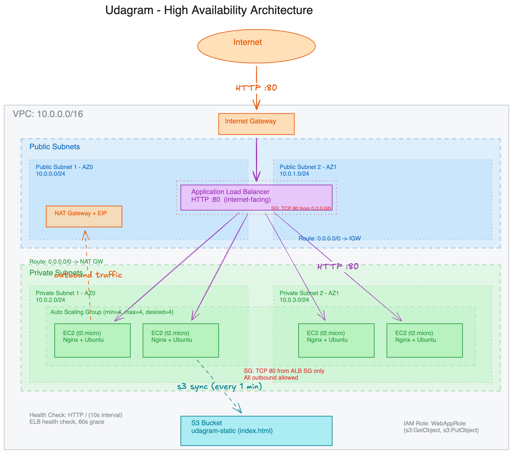

# CD12352 - Infrastructure as Code Project Solution
# [Saleh Alobaylan]

## Overview
This project deploys a highly-available web app using **two CloudFormation stacks**:

- **Network stack** (`udagram-network`): VPC, 2 public subnets, 2 private subnets, Internet Gateway, and 1 NAT Gateway.
- **Application stack** (`udagram-app`): S3 bucket (public read), ALB (port 80), Launch Template, AutoScaling Group, Target Group, Listener, and Security Groups.

Static website content is stored in S3 and is **pulled to the EC2 instances** using `aws s3 sync` in UserData (and re-synced every minute via cron).

## Infrastructure Diagram



## Spin up instructions
From the repo root:

1) Validate the templates:
```bash
aws cloudformation validate-template --template-body file://IAC/network.yml
aws cloudformation validate-template --template-body file://IAC/udagram.yml
```

2) Deploy both stacks and upload the static site:
```bash
bash IAC/scripts/deploy.sh
```

The deploy script prints the **WebAppURL** output (the ALB URL with `http://` in front).

## Tear down instructions
From the repo root:
```bash
bash IAC/scripts/destroy.sh
```

## Evidence of Work (Working Test)

### Working URL
- WebAppURL: http://udagra-webap-fa9bv82vdifw-947935568.us-east-1.elb.amazonaws.com/

### Screenshots (if resources are deleted)
- Network stack outputs (shows time): `../screenshots/screenshot-2026-03-12-04-32-33.png`
- App stack outputs (shows time): `../screenshots/Screenshot 1447-09-23 at 4.34.46 AM.png`
- Browser access via ALB URL: `../screenshots/Screenshot 1447-09-23 at 5.02.24 AM.png`
- S3 bucket with static files: `../screenshots/Screenshot 1447-09-23 at 4.40.35 AM.png`
